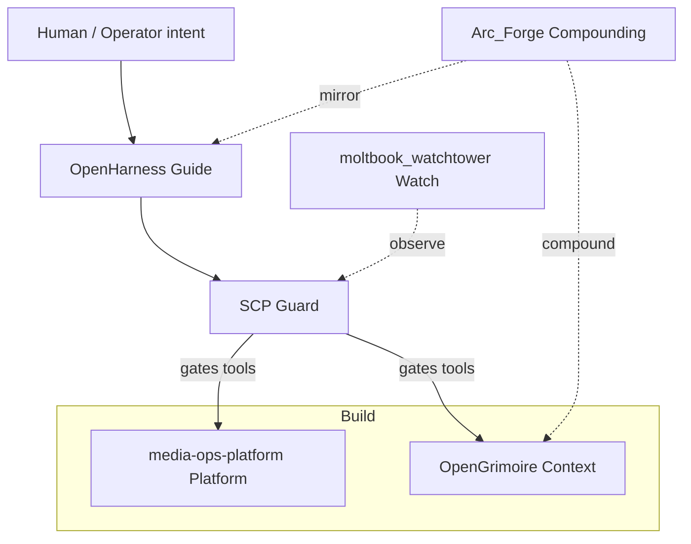

# Backend & Systems Engineer | AI Systems | FastAPI | PostgreSQL | Agent Infrastructure

I build automation pipelines, agent harnesses, and local-first systems where humans stay in the loop—inspectable context, explicit gates, and production-shaped backends (FastAPI, PostgreSQL, Docker, observability).

## Problem → Solution → Impact

- **Problem:** Agent workflows lose intent across sessions; untrusted content reaches LLMs; production ops lack inspectable, human-gated context.
- **Solution:** **Guard–Guide–Build** — SCP (input safety), OpenHarness (handoffs + gates), OpenGrimoire (context graph), plus production platform (CaptionPipeline / Platform API).
- **Impact:** CaptionPipeline (as-of **2025-12**): **256+** caption files, **330+** content hours, **<1%** errors across **9** production feeds ([case study](https://github.com/ManintheCrowds/media-ops-platform/blob/main/docs/portfolio/README.md)); SCP (as-of **2026-06**): **16/16** promptfoo tier probes (OWASP LLM01/LLM06); OpenHarness (as-of **2026-06**): harness pin-able by commit SHA, autoresearch Tier B **5/5** on foam-pkm + frontend-a2ui skills.

*Portfolio metrics SSOT:* [metrics.json](https://github.com/ManintheCrowds/media-ops-platform/blob/main/docs/portfolio/metrics.json) · refreshed `generated_at` via `refresh_metrics.ps1`

## How the proof set fits together

These six repos are the proof set—harness → watch → platform → context → compounding → safety.

## Evaluate in ~10 minutes

| Step | Repo | Command / link |
|------|------|----------------|
| 1 | [OpenHarness](https://github.com/ManintheCrowds/OpenHarness) | `python scripts/verify_script_index.py` (from repo root) |
| 2 | [SCP](https://github.com/ManintheCrowds/SCP) | `npx promptfoo eval` (see README § Testing) |
| 3 | [media-ops-platform](https://github.com/ManintheCrowds/media-ops-platform) | README Quick start — API + stack smoke |
| 4 | [OpenGrimoire](https://github.com/ManintheCrowds/OpenGrimoire) | `npm install && npm run dev` or [CI workflow](https://github.com/ManintheCrowds/OpenGrimoire/actions) |
| 5 | [Arc_Forge](https://github.com/ManintheCrowds/Arc_Forge) | `pytest` (workflow_ui suite) |

## Case studies

- **CaptionPipeline** — automated WhisperX → SCC captions across 9 feeds; as-of **2025-12**: 93.5%+ success, peaks 121 files/day → [portfolio kit](https://github.com/ManintheCrowds/media-ops-platform/tree/main/docs/portfolio/)
- **SCP guardrail** (as-of **2026-06**) — 16/16 promptfoo injection/reversal probes before LLM context → [SCP README § Impact](https://github.com/ManintheCrowds/SCP/blob/main/README.md)
- **Agent harness eval** — as-of **2026-06**: Tier B 5/5 on foam-pkm and frontend-a2ui skills → OpenHarness + MiscRepos autoresearch harness

## Stack

## CI (pinned proof set)

## Skills

- Agent harnesses, handoffs, and intent-alignment gates
- Read-only observability and leak/injection analysis for agent networks
- Local-first context graphs and human↔agent alignment workflows
- LLM input safety (inspect, sanitize, contain, quarantine)
- FastAPI platform APIs, SSO/gateway patterns, homelab observability

## Pinned work

| Project | One line | CI |
|---------|----------|-----|
| [OpenHarness](https://github.com/ManintheCrowds/OpenHarness) | Portable harness: context engineering, handoff flow, intent alignment |  |
| [moltbook_watchtower](https://github.com/ManintheCrowds/moltbook_watchtower) | Read-only observability for agent networks (leak / injection / behavior) | — |
| [media-ops-platform](https://github.com/ManintheCrowds/media-ops-platform) | **CaptionPipeline** + **Platform API** — video captions and homelab integration |  |
| [OpenGrimoire](https://github.com/ManintheCrowds/OpenGrimoire) | Local-first context graph and Sync Session alignment workspace |  |
| [Arc_Forge](https://github.com/ManintheCrowds/Arc_Forge) | Harness mirror + LLM-Wiki compounding in Obsidian |  |
| [SCP](https://github.com/ManintheCrowds/SCP) | Secure Contain Protect — MCP guardrail for LLM inputs (OWASP LLM01/LLM06) |  |

## Socials

Pending

Open an issue on any pinned repo for collaboration or questions.
